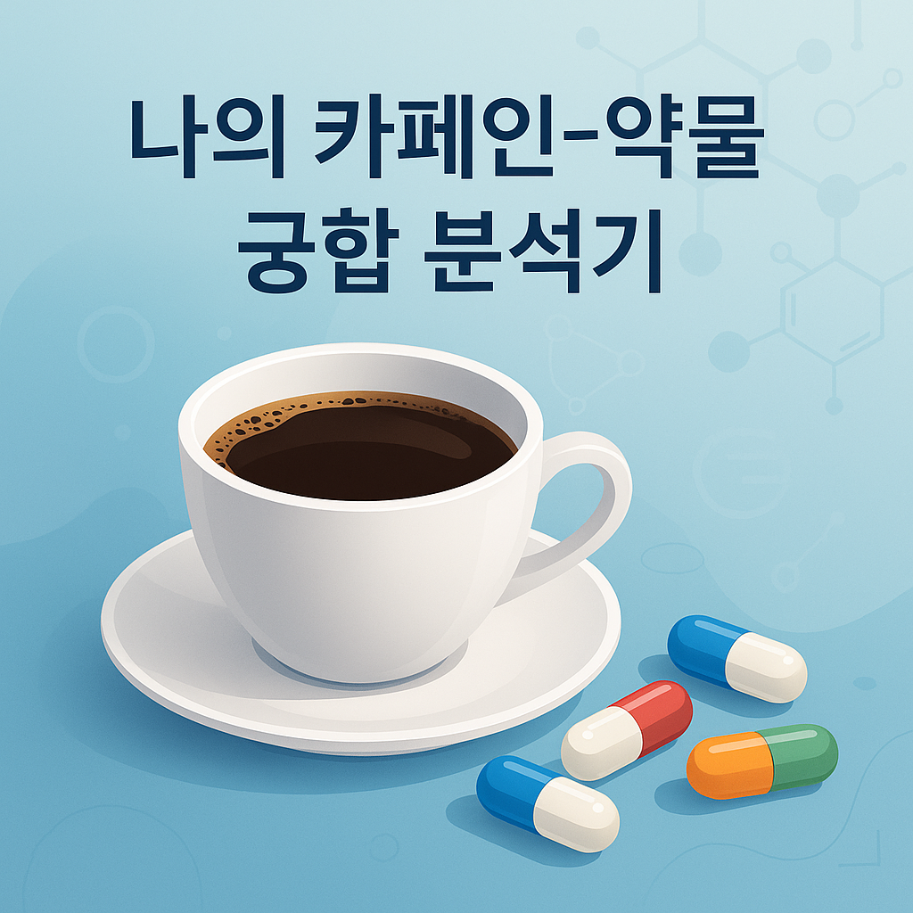

<p align="center">
  
</p>

# Caffeine–Drug Interaction Checker

**카페인-약물 궁합 분석기**: a Streamlit app that checks how a person's daily caffeine intake fits with the medications they take.

> **Early project (May 2025).** I built this in my 4th year of pharmacy school, when I had almost no coding experience. I'm keeping it here as a record of where I started.

---

## What it does

The user enters four groups of information:

| Input | Examples |
|---|---|
| Personal info | name, sex, age, body weight |
| Medications | drug class and the time of day it is taken |
| Caffeine habits | cups per day, time of day |
| Health status | symptoms after caffeine (palpitations, insomnia, heartburn, anxiety), diagnosed conditions |

The app returns a report in four tabs (summary, drug–caffeine interaction, timing analysis, recommendations). The same report can be downloaded as a **PDF**.

**Drug classes covered:** acetaminophen, NSAIDs (ibuprofen, dexibuprofen), antihistamines, sedatives/hypnotics (lorazepam, diazepam, zolpidem), PPIs, and SSRIs.

**Caffeine estimate:** cups × 90 mg, compared against a body-weight limit of 3 mg/kg. The MFDS guideline (400 mg/day for adults, 300 mg/day in pregnancy) is shown for reference.

## How it works

Every result comes from **hand-written if/else rules** based on what I knew of pharmacology at the time. The app title says "AI-based", but there is no machine-learning model in it.

## Run it

```bash
pip install -r requirements.txt
streamlit run caffeine_checker.py
```

You can also open the repository in **GitHub Codespaces**. The dev container installs the requirements and starts the app on port 8501.

## Files

```
├─ caffeine_checker.py   Streamlit app: input form, rule logic, PDF report
├─ fonts/                NanumGothic, for Korean text in the PDF
├─ requirements.txt      streamlit, reportlab
├─ thumbnail.png
└─ .devcontainer/        Codespaces setup
```

## Looking back

If I built this again, I would:

- **Cite a reference for each rule**, so a pharmacist could check it, instead of writing the rules from memory.
- **Use real caffeine amounts.** Every drink currently counts as 90 mg; coffee, tea, and energy drinks differ a lot.
- **Drop the "AI" label** unless a model is actually involved.

---

*For learning purposes only. This is not medical advice.*
